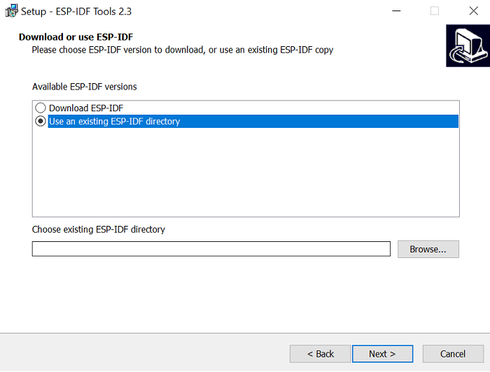

# Microsoft Azure IoT Integration with the Infineon OPTIGA&trade; Trust M 

## Description

This repository contains one of Application Notes for OPTIGA™ Trust M security chip.

## Table of contents
- [Introduction](#introduction)
- [Prerequisites](#prerequisites)
- [Getting Started](#getting-started)
- [Setting up Azure IoT Hub](#setting-up-azure-iot-hub)
- [Porting guide to enable OPTIGA™ Trust M on your MbedTLS package](#porting-guide-to-enable-optiga-trust-m-on-your-mbedtls-package)
- [Personalize OPTIGA™ Trust M Shield2Go](#personalize-optiga-trust-m-shield2go)
- [Configuring and Building Sample](#configuring-and-building-sample) 
- [Troubleshooting](#troubleshooting) 

## Introduction

<a name="introduction"></a>

The ESP OPTIGA Trust M package is based on Azure IoT C SDK and enable users to connect their ESP32 based devices to the Azure IoT hub using OPTIGA™ Trust M security chip for X.509 based security in Azure IoT hub. It provides some examples which can help to understand most common use cases.

## Prerequisites

<a name="prerequisites"></a>

### Hardware

* OPTIGA Trust Personalization Board, alternatively you can use an FTDI FT260 equipped board, such as FTDI - FT260S/Q(TSSOP/WQFN) USB-to-I2C bridge
* [OPTIGA Trust M Shield2Go](https://www.infineon.com/cms/en/product/evaluation-boards/s2go-security-optiga-m/)
* [ESP32-DevKitC](https://www.espressif.com/en/products/hardware/development-boards)

### Software

- ESP-IDF Tools version 2.3
- Certificates generation tool such as OpenSSL

## Getting Started

<a name="get-started"></a>

### Development Host Setup

This project is to be used with Espressif's IoT Development Framework, [ESP IDF](https://github.com/espressif/esp-idf). Follow these steps to get started:

- Setup ESP IDF development environment by following the steps [here](https://docs.espressif.com/projects/esp-idf/en/latest/get-started/index.html).
- Clone the ESP IDF development framework as follows 

Open the Command Prompt, and run the following commands:

``` bash
git clone -b v4.0 --recursive https://github.com/espressif/esp-idf.git
```
- In addition to Cloning the ESP IDF github, Download and install the ESP-IDF Tools Installer for Windows from below link
    
    [ESP-IDF Tools Installer](https://dl.espressif.com/dl/esp-idf-tools-setup-2.3.exe)

- Note : Select ESP-IDF directory extracted in previous step while installing ESP-IDF Tools
     
    
     
- After succesful installation of ESP-IDF Tool, ESP-IDF command prompt will be available in the windows start

- In a separate folder, clone the Azure OPTIGA&trade; Trust M project as follows (please note the --recursive option, which is required to clone the various git submodules required by Azure OPTIGA&trade; Trust M)

``` bash
git clone --recursive Need to be updated
```

> Note that if you ever change the branch or the git head of either esp-idf or esp-azure, ensure that all the submodules of the git repo are in sync by executing `git submodule update --init --recursive`

- Clone the personalize-optiga-trust package as follows

``` bash
git clone --recursive https://github.com/Infineon/personalize-optiga-trust
```
- Install OpenSSL which is used as an example to generate certificate in this document. OpenSSL can be downloaded from below link

    [Openssl EXE](https://slproweb.com/products/Win32OpenSSL.html)
##
## Setting up Azure IoT Hub

<a name="setting-up-azure-iot-hub"></a>

### Create an IoT Hub using the Azure portal

- Create an account and get an [Azure subscription](https://azure.microsoft.com/en-in/free/?WT.mc_id=A261C142F) if you do not have an Azure subscription already.
- Create an Azure IoT Hub by following the documentation [here](https://docs.microsoft.com/en-us/azure/iot-hub/iot-hub-create-through-portal).

> **Note: When selecting the "Pricing and scale tier", there is also an option to select , F1: Free tier, which should be sufficient for basic evaluation.**

### Register and Authenticate X.509 CA certificate to IoT Hub

- Generate X.509 CA certificate using tools such as OpenSSL. To generate CA certificate using OpenSSL, execute the below commands
    ``` bash
    openssl ecparam -name prime256v1 -genkey -noout –out ca_key_pair.pem
    openssl req -new -key ca_key_pair.pem -out csr_ca.csr
    openssl req -x509 -sha256 -days 365 -key ca_key_pair.pem -in csr_ca.csr -out ca_cert.cer
    ```
    - During execution of second command, You will be prompted to give Distinguished Names(DN). Common Name (CN) is mandatory field in DN details. Give any user-friendly common name for csr generation, other fields can be skipped
    - parameter "-out" is used to generate output as per user defined name
    - After execution of third command, user defined CA certificate will be generated (ca_cert.cer)

### Register X.509 CA certificate to your IoT Hub through azure portal

- Register a CA certficcate to the IoT Hub created in the above step by following steps 1 to 6 under section **Register X.509 CA certificates to your IoT hub** from the documentation [here](https://docs.microsoft.com/en-us/azure/iot-hub/iot-hub-security-x509-get-started#register-x509-ca-certificates-to-your-iot-hub) and copy the generated  **Verification Code**
    - Using the Verification code from the above step, Create .csr(csr_verification.csr) file to generate verification certificate which is required to verify X.509 CA certificate.
        ```sh
         openssl req -new -key ca_key_pair.pem -out csr_verification.csr
        ```
        - Note: User can generate new keys or can use same CA keys generated in previous section to generate verification csr file.
        - when prompted for distinguished names, common name must be provided as **Verification Code** , other fields can be skipped
    - Generate Verification certificate and sign it using X.509 CA certificate  
        ```sh
        openssl x509 -req -in csr_verification.csr -CA ca_cert.cer -CAkey ca_key_pair.pem -CAcreateserial -out Verification_Cer.cer -days 500 -sha256
        ```
  - Go to Certificate Details in Azure portal, under Verification Certificate .pem or .cer file, find and upload the generated verification certificate file (Verification_Cer.cer), then select Verify 
  - Ensure that status of your certificate updated to **Verified**

### Creating an Azure IoT Device

- Create an Azure IoT Hub by following steps under section **Create an X.509 device for your IoT hub** from the the documentation [here](https://docs.microsoft.com/en-us/azure/iot-hub/iot-hub-security-x509-get-started#create-an-x509-device-for-your-iot-hub).
- Note down newly created IoT Device **Device ID** 

## Porting guide to enable OPTIGA™ Trust M on your MbedTLS package

<a name="porting-guide-to-enable-optiga-trust-m-on-your-mbedtls-package"></a>

- If you want to port Trust M onto any board where MbedTLS is used for crypto operation, you can follow the steps in documentation [here](https://github.com/Infineon/azure-optiga-trust-m/tree/master/docs).

## Personalize OPTIGA™ Trust M Shield2Go

<a name="personalize-optiga-trust-m-shield2go"></a>

- Install required OPTIGA Trust python package

  ```bash
  pip3 install optigatrust
  ```
- Connect OPTIGA Trust Personalization Board with OPTIGA Trust M Shield2Go to your PC
    
   

- Change the working directory to cloned repository of &quot;personalize-optiga-trust&quot;
- Inside the repository change the working directory to &quot;workspace&quot;

    ```sh
    cd personalize-optiga-trust/using-amazon-root-ca/workspace
    ```
- Open the &quot;config_nistp256_ecdsa_secondslot.jsn&quot; Json file and update the &quot;common_name&quot; must be updated as [Device ID] noted down while creating the IoT device
    - Note: slot second "config_nistp256_ecdsa_secondslot.jsn" can be used for OPTIGA key pair object 0xE0F1 and 0xE0E1
- Personalize OPTIGA™ Trust M Shield2Go with private key and device certificate using below command 
    ```bash
    python ../../optiga.py --csr config_nistp256_ecdsa_secondslot.jsn
    ```
- Above command will generate key pair and load the private key to OPTIGA chip in a slot as provided in .jsn file and generates **csr file** (.csr). Successful execution will generate logs as below.
    ```bash
    Your configuration is following:
    {
        "certificate_info": {
            "common_name": "test_device_ca_signed",
            "country_name": "DE",
            "organization_name": "Infineon Technologies AG",
            "state_or_province_name": "Bayern"
        },
        "key_info": {
            "algorithm_id": "ec",
            "parameters": {
                "curve": "secp256r1",
                "slot": "0xE0F1"
            }
        },
        "signature_info": {
            "algorithm_id": "ecdsa",
            "parameters": {
                "hash_alg": "sha256"
            }
        }
    }
    Loaded: liboptigatrust-libusb-win-amd64.dll
    {'filename': '039ebf63ff617e807d9bd71f0b5ba51ed1a7b1f6.csr', 'public_key': '034200046e0fceb4aec1ce736ec03a3bf61189b2d3560c3d14134472b2537318f408a228e471c35ef28c530567eb31fd7d58d7521c979a1410d638646c0a66a6053f7857'}
    C:\Users\username\Desktop\personalize-optiga-trust\using-amazon-root-ca\workspace>openssl x509 -req -in 039ebf63ff617e807d9bd71f0b5ba51ed1a7b1f6.csr -CA Azure_CA_Cert_test.crt -CAkey azure_ca_256_key.pem -CAcreateserial -out AzureOptigaEndCert.pem -days 500 -sha256
    Signature ok
    subject=C = DE, ST = Bayern, O = Infineon Technologies AG, CN = test_device_ca_signed
    Getting CA Private Key
    ```
- Verify **csr file** generated in previous step using the below OpenSSL command

    ```bash
    openssl req -in <csr file> -noout -text –verify
    ```
- Create the device certificate using CA certificate and corresponding CA keypair which is registered in the azure IoT Hub

    ```bash
    openssl x509 -req -in <csr file> -CA ca_cert.cer -CAkey ca_key_pair.pem  -CAcreateserial -out device_cert.pem -days 500 -sha256
    ```
 - Personalize the device certificate to OPTIGA Trust M Shield2Go
    ```bash
    python ../../optiga.py --write device_cert.pem --slot second
    ```
    Successful execution will generate logs as below
    ```bash
    Your are going to write the following file:
    -----BEGIN CERTIFICATE-----
    MIIBlDCCATkCCQC+VmEpQyRNSTAKBggqhkjOPQQDAjBCMQswCQYDVQQGEwJJTjEN
    MAsGA1UEChMESUZJTjEMMAoGA1UECxMDRVNTMRYwFAYDVQQDDA1BenVyZV9DQV9D
    ZXJ0MB4XDTIwMDIyNjE3NDcyNloXDTIxMDcxMDE3NDcyNlowYTELMAkGA1UEBhMC
    REUxDzANBgNVBAgMBkJheWVybjEhMB8GA1UECgwYSW5maW5lb24gVGVjaG5vbG9n
    aWVzIEFHMR4wHAYDVQQDDBV0ZXN0X2RldmljZV9jYV9zaWduZWQwWTATBgcqhkjO
    PQIBBggqhkjOPQMBBwNCAATkaoThG+cBNnRrEoFPlkpc8XQqSjRx0GtHE5V1/nj0
    OesIOgKlG3ih/FFphDybUYtgoLLWb6H51Pk7VFswUcwNMAoGCCqGSM49BAMCA0kA
    MEYCIQCEWaSyM+u0AKEgi0/zWZ4hAF6b7Y7qPKAETXn4iJQpnwIhAMyUq275MI4U
    p186UKmIO8LkVpMmJuJi1cuF1j/CZ5pB
    -----END CERTIFICATE-----
    
    Loaded: liboptigatrust-libusb-win-amd64.dll
    Certificate has been written
    ```
## Configuring and Building Sample

- Connect OPTIGA Trust M Shield2Go with ESP32 to your PC via USB cable. Note the serial port where ESP32 board is connected.

    

- Copy the below text to the  the &quot;CMakeLists.txt&quot; located under <esp-idf/components/mbedtls> below the **set(mbedtls_targets mbedtls mbedcrypto mbedx509)** text
    ```sh
    include("${OPTIGA_COMPONENT_DIRS}/CMakeLists.txt")
    ```
- Follow this step only if Server root CA is loaded into any of OPTIGA data object 
    - Enable macro "LOAD_TA_FROM_OPTIGA" in "esp-azure\examples\iothub_client_sample_mqtt\main\ iothub_client_sample_mqtt.c" file and define trust_anchor as optiga data object which is loaded with server root CA as below
         ```sh
        /* Enable LOAD_TA_FROM_OPTIGA if server root certificate is loaded in otpiga */
        #define LOAD_TA_FROM_OPTIGA 0    // 1 = Enable, 0 = Disable
        
        #if LOAD_TA_FROM_OPTIGA
        //Read trust anchor from OPTIGA
        #define trust_anchor 0xE0E8
        static char trust_anchor_pem [1300] = {0};
        static uint16_t trust_anchor_pem_length = sizeof(trust_anchor_pem);
        #endif
        ```
    - To enable server validation using OPTIGA, region specific server root CA certificate must be loaded in any of OPTIGA data object either by personalization or by writing to object using OPTIGA write API
    - To load trust anchor using OPTIGA write API, modify file <esp-idf\components\optiga\optiga\optiga_trust.c> as below
        - Define OPTIGA_TA with optiga data object where server root CA requires to be loaded and define trust_anchor with region specific root CA in API "write_optiga_trust_anchor(void)"
        - Note: user can either choose from available certificate or can provide specific certificate 
            ```sh
            static void write_optiga_trust_anchor(void)
            {
            #define OPTIGA_TA 0xE0E8 
            #if 0
            	/* DigiCert Baltimore Root --Used Globally--*/
            	// This cert should be used when connecting to Azure IoT on the Azure Cloud available globally. 
            	const uint8_t trust_anchor[] = {
            		                            //contains Baltimore certificate data 
            	                               };
            	   write_data_object(OPTIGA_TA, trust_anchor, sizeof(trust_anchor));
            #endif //Baltimore
            
            #if 0
            	/* DigiCert Global Root CA */
            	// This cert should be used when connecting to Azure IoT on the https://portal.azure.cn Cloud address.
            	
            	const uint8_t trust_anchor[] = {
            		                            //contains DigiCert Global Root CA
            	                               };
            	   write_data_object(OPTIGA_TA, trust_anchor, sizeof(trust_anchor));
            #endif //DigiCert Global Root CA
            
            #if 0
            	/* D-TRUST Root Class 3 CA 2 2009 */
            	// This cert should be used when connecting to Azure IoT on the https://portal.microsoftazure.de Cloud address.
            	
            	const uint8_t trust_anchor[] = {
            		                            //D-TRUST Root Class 3 CA
            	                               };
            	   write_data_object(OPTIGA_TA, trust_anchor, sizeof(trust_anchor));
            #endif //D-TRUST Root Class 3 CA 2 2009
            
            #if 0
    	    /* User can provide a specific server certificate here and can load in any data object of optiga */
        
        	const uint8_t trust_anchor[] = = {
            		                      //place to provide region specific server root CA certificate  
            	                           };
                   write_data_object(OPTIGA_TA, trust_anchor, sizeof(trust_anchor));
            #endif //Region Specific Certificate 
            
            }
            ```
         
        - Uncomment write_optiga_trust_anchor in API "optiga_trust_init(void)" as below:
            ```sh
      	   //The below specified functions can be used to personalize OPTIGA w.r.t
	        //certificates, Trust Anchors, etc.
		
            //write_device_certificate ();s
            //write_set_high_performance();  //setting current limitation to 15mA
            //write_platform_binding_secret ();  
            //read_certificate ();
    	    //write_optiga_trust_anchor();  //can be used to write server root certificate to optiga data object  
            ```

- Go to windows start menu and Open ESP-IDF command prompt
    ```bash
    Setting IDF_PATH: C:\Users\username\Desktop\esp-idf
    
    Adding ESP-IDF tools to PATH...
        C:\Users\username\.espressif\tools\xtensa-esp32-elf\esp-2019r2-8.2.0\xtensa-esp32-elf\bin
        C:\Users\username\.espressif\tools\esp32ulp-elf\2.28.51.20170517\esp32ulp-elf-binutils\bin
        C:\Users\username\.espressif\tools\cmake\3.13.4\bin
        C:\Users\username\.espressif\tools\openocd-esp32\v0.10.0-esp32-20190313\openocd-esp32\bin
        C:\Users\username\.espressif\tools\mconf\v4.6.0.0-idf-20190628\
        C:\Users\username\.espressif\tools\ninja\1.9.0\
        C:\Users\username\.espressif\tools\idf-exe\1.0.1\
        C:\Users\username\.espressif\tools\ccache\3.7\
        C:\Users\username\.espressif\python_env\idf4.0_py3.7_env\Scripts
        C:\Users\username\Desktop\esp-idf\tools
    
    Checking if Python packages are up to date...
    Python requirements from C:\Users\username\Desktop\esp-idf\requirements.txt are satisfied.
    
    Done! You can now compile ESP-IDF projects.
    Go to the project directory and run:
    
    idf.py build
    
    
    C:\Users\username\Desktop\esp-idf>
    ```
- Change working directory to <esp-azure\examples\iothub_client_sample_mqtt>
- Configure "example configuration" using below command

    ```sh
    idf.py menuconfig
    ```
    

    - Select Example Configuration and update WiFi SSID, WiFi Password and IoT Hub device connection string 
    
        
    
    - To get IoT Hub Device Connection String: 
        - navigate to your IoT Hub, and then select Setting > shared Access policies > iothubowner
        - Under shared access keys, copy connection string – primary key Ex: "HostName=**your_IoT_hub_name.azure-devices.net**;SharedAccessKeyName=iothubowner;SharedAccessKey=id9ublohj/CdVFb5jLS/9bF3hAfqE2TRpb4woDhlciM="
        - Update Host name and device id name from the above step in the below connection string
        ```bash 
        "HostName=**your_IoT_hub_name.azure-devices.net**;DeviceId=[Device ID];x509=true"
        ```
        - Update the above connection string as IoT Hub Device Connection String in the Example Configuration


- Build Sample project and Flash ESP32 using below command 
    ```bash
    idf.py build
    idf.py -p <ESP32 serial port> flash
        E.g.: idf.py -p com7 flash

    //Custom build folder
    idf.py -B <CUSTOM_BUILD_FOLDER> build    
    idf.py -B <CUSTOM_BUILD_FOLDER> -p <ESP32 serial port> flash
    E.g. : idf.py -B c:\esp-build build
         : idf.py -B c:\esp-build -p com7 flash
    ```
- During Sample project, if you get an error as **ccache error : Failed to create temprorary file** then this is due to file path length restriction to 260 characters.To avoid this error, clone the Azure OPTIGA Trust M to the top level directory such as in C or D drive or use custom build folder as the top level directory as mentioned in above step
- Once sample project is flashed successfully, you can monitor communication between ESP32 and your azure IoT Hub device using
    ```sh
    idf.py monitor
    ```
    
    
- To monitor events on Azure cloud, navigate to Cloud shell on azure portal and execute below commands
    ```sh
    az extension add --name azure-cli-iot-ext 
   az iot hub monitor-events -n <your IoT Hub Name>
    ```
    
    
   
   
- To send message from Azure cloud to ESP32 during active communication:
    ```sh
      az iot device c2d-message send -d Iot Device name -n IoT-Hub name --data "message"
    ```
## Troubleshooting
<a name="troubleshooting"></a>

1. Some common problems can be fixed by disabling the firewall.

2. You can try with the followings, if your build fails:
	- `$ git submodule update --init --recursive`
	- Check the compiler version and verify that it is the correct one for your ESP IDF version.
	- Check if the IDF_PATH is set correctly
	- Clean the project with `make clean` and if required, using `rm -rf build sdkconfig sdkconfig.old`
	
3. Ensure that the device connection string received from Azure IoT Hub are correct.

## Contributing
Please read [CONTRIBUTING.md](https://github.com/Infineon/arduino-optiga-trust-x/blob/master/CONTRIBUTING.md) for details on our code of conduct, and the process for submitting pull requests to us.

## License
This project is licensed under the MIT License - see the [LICENSE](LICENSE) file for details
