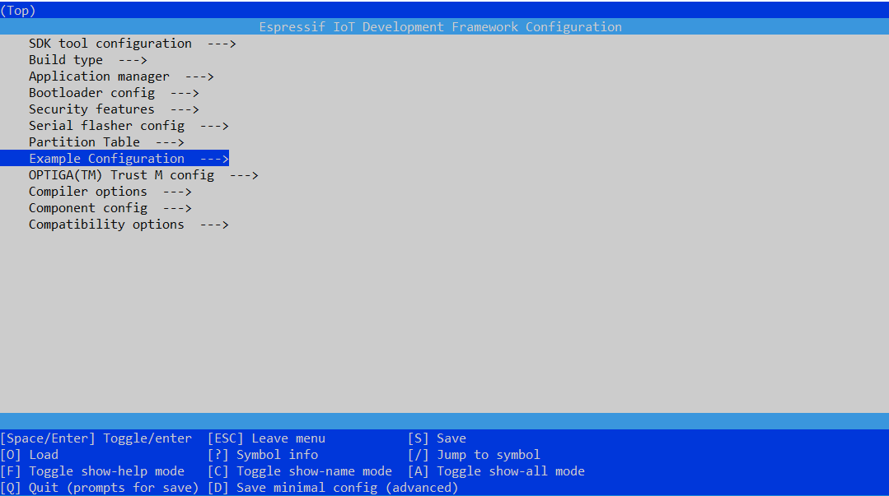

# Microsoft Azure IoT Integration with </br> the Infineon OPTIGA&trade; Trust M 

* [Introduction](#introduction)
* [Required Hardware and Software](#Required-Hardware-and-Software)
* [Getting Started](#getting-started)
  * [Step 1. Downlaod and install missing components](#Step-1-Downlaod-and-install-missing-components )
  * [Step 2. Setting up Microsoft Azure IoT Hub](#Step-2-Setting-up-Microsoft-Azure-IoT-Hub)
  * [Step 3. Configuring and Building Sample](#Step-3-configuring-and-building-sample)
* [Porting guide for mbedTLS](PortingGuide.md)
* [Troubleshooting](#troubleshooting)
* [Contributing](#Contributing)
* [License](#License)

## Introduction

The ESP Azure OPTIGA™ Trust M package is based on Azure IoT C SDK and allows to connect Espressif ESP32 based devices to the Azure IoT hub using OPTIGA™ Trust M security chip for X.509 based security in Azure IoT hub. It provides some examples which can help to understand most common use cases.

## Hardware

  * [OPTIGA Trust M Shield2Go](https://www.infineon.com/cms/en/product/evaluation-boards/s2go-security-optiga-m/)
  * [ESP32-DevKitC](https://www.espressif.com/en/products/hardware/development-boards)
  <details>
	<summary>Connection example</summary>
	
  </details>
  
This Application Note uses Espressif ESP32, but it also shows how to port onto another host platform. You can find more information [below](#porting-guide-to-enable-optiga-trust-m-on-your-mbedtls-package) 

## Getting Started

### Step 1. Downlaod and install missing components 

1. **ESP-IDF ver. 4.1** .ESP IDF stands for Espressif IoT Development Framework. The installation guidelines based on you setup can be found [here](ESP-IDF (Espressif IoT Development Framework)). Please try to build a sample ["Hello World"](https://docs.espressif.com/projects/esp-idf/en/latest/esp32/get-started/index.html#step-5-start-a-project) project before continuing.

2. **This repository**
  ``` bash
  git clone --recursive https://github.com/Infineon/azure-optiga-trust-m
  ```

## Step 2. Setting up Microsoft Azure IoT Hub

### Create an IoT Hub using the Azure portal

- Create an account and get an [Azure subscription](https://azure.microsoft.com/en-in/free/?WT.mc_id=A261C142F) if you do not have an Azure subscription already.
- Create an Azure IoT Hub by following the documentation [here](https://docs.microsoft.com/en-us/azure/iot-hub/iot-hub-create-through-portal#create-an-iot-hub).

> **Note: When selecting the "Pricing and scale tier", there is also an option to select , F1: Free tier, which should be sufficient for basic evaluation.**

### Create a CA certificate for Azure IoT Hub

For this please follow first **three** steps from the [guidance below](https://github.com/Azure/azure-iot-sdk-c/blob/master/tools/CACertificates/CACertificateOverview.md), namelly "Step 1 - Initial Setup", and "Step 2 - Create the certificate chain", and "Step 3 - Proof of Possession".


### Creating a new Azure IoT Device

- Create an Azure IoT Hub by following steps under section **Create an X.509 device for your IoT hub** from the documentation [here](https://docs.microsoft.com/en-us/azure/iot-hub/iot-hub-security-x509-get-started#create-an-x509-device-for-your-iot-hub).
- Note down newly created IoT Device **Device ID** 

### Personalize OPTIGA™ Trust M Shield2Go

<a name="personalize-optiga-trust-m-shield2go"></a>

- Install required OPTIGA Trust python package

  ```bash
  pip3 install optigatrust
  ```
- Connect OPTIGA Trust Personalization Board with OPTIGA Trust M Shield2Go to your PC
    
   

- Change the working directory to cloned repository of &quot;personalize-optiga-trust&quot;
- Inside the repository change the working directory to &quot;workspace&quot;

    ```sh
    cd personalize-optiga-trust/using-amazon-root-ca/workspace
    ```
- Open the &quot;config_nistp256_ecdsa_secondslot.jsn&quot; Json file and update the &quot;common_name&quot; must be updated as [Device ID] noted down while creating the IoT device
    - Note: slot second "config_nistp256_ecdsa_secondslot.jsn" can be used for OPTIGA key pair object 0xE0F1 and 0xE0E1
- Personalize OPTIGA™ Trust M Shield2Go with private key and device certificate using below command 
    ```bash
    python ../../optiga.py --csr config_nistp256_ecdsa_secondslot.jsn
    ```
- Above command will generate key pair and load the private key to OPTIGA chip in a slot as provided in .jsn file and generates **csr file** (.csr). Successful execution will generate logs as below.
    ```bash
    Your configuration is following:
    {
        "certificate_info": {
            "common_name": "test_device_ca_signed",
            "country_name": "DE",
            "organization_name": "Infineon Technologies AG",
            "state_or_province_name": "Bayern"
        },
        "key_info": {
            "algorithm_id": "ec",
            "parameters": {
                "curve": "secp256r1",
                "slot": "0xE0F1"
            }
        },
        "signature_info": {
            "algorithm_id": "ecdsa",
            "parameters": {
                "hash_alg": "sha256"
            }
        }
    }
    Loaded: liboptigatrust-libusb-win-amd64.dll
    {'filename': '039ebf63ff617e807d9bd71f0b5ba51ed1a7b1f6.csr', 'public_key': '034200046e0fceb4aec1ce736ec03a3bf61189b2d3560c3d14134472b2537318f408a228e471c35ef28c530567eb31fd7d58d7521c979a1410d638646c0a66a6053f7857'}
    C:\Users\username\Desktop\personalize-optiga-trust\using-amazon-root-ca\workspace>openssl x509 -req -in 039ebf63ff617e807d9bd71f0b5ba51ed1a7b1f6.csr -CA Azure_CA_Cert_test.crt -CAkey azure_ca_256_key.pem -CAcreateserial -out AzureOptigaEndCert.pem -days 500 -sha256
    Signature ok
    subject=C = DE, ST = Bayern, O = Infineon Technologies AG, CN = test_device_ca_signed
    Getting CA Private Key
    ```
- Verify **csr file** generated in previous step using the below OpenSSL command

    ```bash
    openssl req -in <csr file> -noout -text –verify
    ```
- Create the device certificate using CA certificate and corresponding CA keypair which is registered in the azure IoT Hub

    ```bash
    openssl x509 -req -in <csr file> -CA ca_cert.cer -CAkey ca_key_pair.pem  -CAcreateserial -out device_cert.pem -days 500 -sha256
    ```
 - Personalize the device certificate to OPTIGA Trust M Shield2Go
    ```bash
    python ../../optiga.py --write device_cert.pem --slot second
    ```
    Successful execution will generate logs as below
    ```bash
    Your are going to write the following file:
    -----BEGIN CERTIFICATE-----
    MIIBlDCCATkCCQC+VmEpQyRNSTAKBggqhkjOPQQDAjBCMQswCQYDVQQGEwJJTjEN
    MAsGA1UEChMESUZJTjEMMAoGA1UECxMDRVNTMRYwFAYDVQQDDA1BenVyZV9DQV9D
    ZXJ0MB4XDTIwMDIyNjE3NDcyNloXDTIxMDcxMDE3NDcyNlowYTELMAkGA1UEBhMC
    REUxDzANBgNVBAgMBkJheWVybjEhMB8GA1UECgwYSW5maW5lb24gVGVjaG5vbG9n
    aWVzIEFHMR4wHAYDVQQDDBV0ZXN0X2RldmljZV9jYV9zaWduZWQwWTATBgcqhkjO
    PQIBBggqhkjOPQMBBwNCAATkaoThG+cBNnRrEoFPlkpc8XQqSjRx0GtHE5V1/nj0
    OesIOgKlG3ih/FFphDybUYtgoLLWb6H51Pk7VFswUcwNMAoGCCqGSM49BAMCA0kA
    MEYCIQCEWaSyM+u0AKEgi0/zWZ4hAF6b7Y7qPKAETXn4iJQpnwIhAMyUq275MI4U
    p186UKmIO8LkVpMmJuJi1cuF1j/CZ5pB
    -----END CERTIFICATE-----
    
    Loaded: liboptigatrust-libusb-win-amd64.dll
    Certificate has been written
    ```
## Configuring and Building Sample

- Open the file **"optiga_lib_config.h"** present in the below given path and update the value of macro **"OPTIGA_COMMS_DEFAULT_RESET_TYPE"** to **"1"** 
    ```sh
    File path : azure-optiga-trust-m\components\optiga\optiga-trust-m\optiga\include\optiga
    ```
- Follow this step only if Server root CA is loaded into any of OPTIGA data object 
    - Enable macro "LOAD_TA_FROM_OPTIGA" in <azure-optiga-trust-m\examples\iothub_client_sample_mqtt\main\iothub_client_sample_mqtt.c> file by setting value as "1"
         ```sh
        /* Enable LOAD_TA_FROM_OPTIGA if server root certificate is loaded in optiga */
        #define LOAD_TA_FROM_OPTIGA 0    // 1 = Enable, 0 = Disable
        ```
    - To enable server validation using OPTIGA, region specific server root CA certificate must be loaded in any of OPTIGA data object either by personalization or by writing to object using OPTIGA write API
    - To load trust anchor using OPTIGA write API, modify file <azure-optiga-trust-m\components\optiga\optiga-trust-m\examples\utilities\optiga_trust.c> as below
        - User can choose the root CA as either from the below available certificate or can provide specific certificate by setting value as "1". E.g.:  #if 1
            ```sh
            static void write_optiga_trust_anchor(void)
            {
            #if 0
            	/* DigiCert Baltimore Root --Used Globally--*/
            	// This cert should be used when connecting to Azure IoT on the Azure Cloud available globally. 
            	const uint8_t trust_anchor[] = {
            		                            //contains Baltimore certificate data 
            	                               };
            	   write_data_object(OPTIGA_TA, trust_anchor, sizeof(trust_anchor));
            #endif //Baltimore
            
            #if 0
            	/* DigiCert Global Root CA */
            	// This cert should be used when connecting to Azure IoT on the https://portal.azure.cn Cloud address.
            	
            	const uint8_t trust_anchor[] = {
            		                            //contains DigiCert Global Root CA
            	                               };
            	   write_data_object(OPTIGA_TA, trust_anchor, sizeof(trust_anchor));
            #endif //DigiCert Global Root CA
            
            #if 0
            	/* D-TRUST Root Class 3 CA 2 2009 */
            	// This cert should be used when connecting to Azure IoT on the https://portal.microsoftazure.de Cloud address.
            	
            	const uint8_t trust_anchor[] = {
            		                            //D-TRUST Root Class 3 CA
            	                               };
            	   write_data_object(OPTIGA_TA, trust_anchor, sizeof(trust_anchor));
            #endif //D-TRUST Root Class 3 CA 2 2009
            
            #if 0
    	    /* User can provide a specific server certificate here and can load in any data object of optiga */
        
        	const uint8_t trust_anchor[] = = {
            		                      //place to provide region specific server root CA certificate  
            	                           };
                   write_data_object(OPTIGA_TA, trust_anchor, sizeof(trust_anchor));
            #endif //Region Specific Certificate 
            
            }
            ```
         
        - Uncomment write_optiga_trust_anchor in API "optiga_trust_init(void)" as below:
            ```sh
      	   //The below specified functions can be used to personalize OPTIGA w.r.t
	        //certificates, Trust Anchors, etc.
		
            //write_device_certificate ();
            //write_set_high_performance();  //setting current limitation to 15mA
            //write_platform_binding_secret ();  
            //read_certificate ();
    	    //write_optiga_trust_anchor();  //can be used to write server root certificate to optiga data object  
            ```

- Go to windows start menu and Open ESP-IDF command prompt
    ```bash
    Setting IDF_PATH: C:\Users\username\Desktop\esp-idf
    
    Adding ESP-IDF tools to PATH...
        C:\Users\username\.espressif\tools\xtensa-esp32-elf\esp-2019r2-8.2.0\xtensa-esp32-elf\bin
        C:\Users\username\.espressif\tools\esp32ulp-elf\2.28.51.20170517\esp32ulp-elf-binutils\bin
        C:\Users\username\.espressif\tools\cmake\3.13.4\bin
        C:\Users\username\.espressif\tools\openocd-esp32\v0.10.0-esp32-20190313\openocd-esp32\bin
        C:\Users\username\.espressif\tools\mconf\v4.6.0.0-idf-20190628\
        C:\Users\username\.espressif\tools\ninja\1.9.0\
        C:\Users\username\.espressif\tools\idf-exe\1.0.1\
        C:\Users\username\.espressif\tools\ccache\3.7\
        C:\Users\username\.espressif\python_env\idf4.0_py3.7_env\Scripts
        C:\Users\username\Desktop\esp-idf\tools
    
    Checking if Python packages are up to date...
    Python requirements from C:\Users\username\Desktop\esp-idf\requirements.txt are satisfied.
    
    Done! You can now compile ESP-IDF projects.
    Go to the project directory and run:
    
    idf.py build
    
    
    C:\Users\username\Desktop\esp-idf>
    ```
- Change working directory to <azure-optiga-trust-m\examples\iothub_client_sample_mqtt>
- Configure "Example Configuration" and "OPTIGA(TM) Trust M config" using below command

    ```sh
    idf.py menuconfig
    ```
    

- Select Example Configuration and update WiFi SSID, WiFi Password and IoT Hub device connection string 

    

- To get IoT Hub Device Connection String: 
    - navigate to your IoT Hub, and then select Setting > shared Access policies > iothubowner
    - Under shared access keys, copy connection string – primary key E.g.: "HostName=**your_IoT_hub_name.azure-devices.net**;SharedAccessKeyName=iothubowner;SharedAccessKey=id9ublohj/CdVFb5jLS/9bF3hAfqE2TRpb4woDhlciM="
    - Update Host name and device id name from the above step in the below connection string
    ```bash 
    "HostName=**your_IoT_hub_name.azure-devices.net**;DeviceId=[Device ID];x509=true"
    ```
    - Update the above connection string as IoT Hub Device Connection String in the Example Configuration and save the configuration
- Go back to the main page of menuconfig and select "OPTIGA(TM) Trust M config" option and update the below parameters:

    
    
    - Select the certificate Slot out of 4 slots provided, where the device certificate is personalized
    - Select the Private Key slot out of 4 slots provided, where the device private key is personalized
    - Select the Trust Anchor slot out of 3 slots provided, where the Azure trust anchor is personalized 

    

- Build Sample project and Flash ESP32 using below command 
    ```bash	
    idf.py build
    idf.py -p <ESP32 serial port> flash
        E.g.: idf.py -p com7 flash

    //Custom build folder
    idf.py -B <CUSTOM_BUILD_FOLDER> build    
    idf.py -B <CUSTOM_BUILD_FOLDER> -p <ESP32 serial port> flash
    E.g. : idf.py -B c:\esp-build build
         : idf.py -B c:\esp-build -p com7 flash
    ```
> Note: During Sample project build, if you get an error as **ccache error : Failed to create temprorary file** then this is due to file path length restriction to 260 characters. To avoid this error, clone the Azure OPTIGA Trust M to the top level directory such as in C or D drive or use custom build folder as the top level directory as mentioned in above step
- Once sample project is flashed successfully, you can monitor communication between ESP32 and your azure IoT Hub device using
    ```sh
    idf.py monitor
    ```
    
    
- To monitor events on Azure cloud, navigate to Cloud shell on azure portal and execute below commands
    ```sh
    az extension add --name azure-cli-iot-ext 
   az iot hub monitor-events -n <your IoT Hub Name>
    ```
    
    
   
   
- To send message from Azure cloud to ESP32 during active communication:
    ```sh
      az iot device c2d-message send -d Iot Device name -n IoT-Hub name --data "message"
    ```
## Troubleshooting
<a name="troubleshooting"></a>

1. Some common problems can be fixed by disabling the firewall.

2. You can try with the followings, if your build fails:
	- `git submodule update --init --recursive`
	- Check the compiler version and verify that it is the correct one for your ESP IDF version.
	- Check if the IDF_PATH is set correctly
	- Clean the project with “idf.py fullclean”	
3. Ensure that the device connection string received from Azure IoT Hub are correct.

## Contributing
Please read [CONTRIBUTING.md](https://github.com/Infineon/arduino-optiga-trust-x/blob/master/CONTRIBUTING.md) for details on our code of conduct, and the process for submitting pull requests to us.

## License
This project is licensed under the MIT License - see the [LICENSE](LICENSE) file for details

